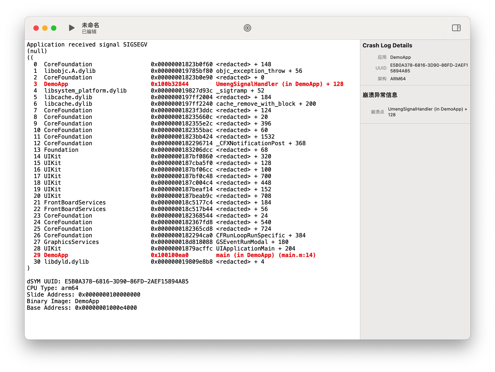
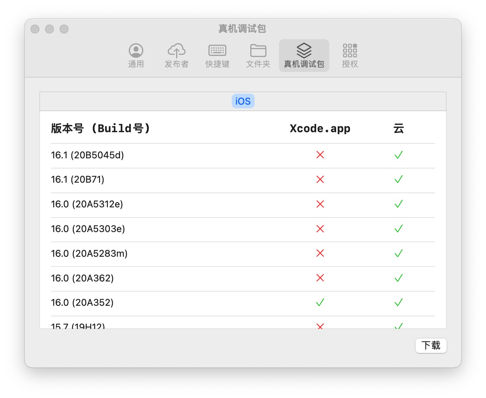

# Serendipity
**Serendipity** is a **mac application** that integrates automatic packaging and uploading, mobileprovision file management, crash log parsing, symbol file parsing, and automatic configuration of iOS debugging packages.

The code is mainly written in SwiftUI, pure local tool management application

>   **[中文版 README](https://github.com/DanielHusx/Serendipity/blob/main/README.md)**

#### Environmental support

- macOS 12.0+
- **Note: Be sure to turn on `Full Disk Access`**, otherwise the manager will not be able to automatically search for related files

#### [The latest v2.0.0](https://github.com/DanielHusx/Serendipity/releases/download/v2.0.0/Serendipity.dmg) 2022-11-11

Singles' Day releases a new version, don't be too tied to Thanks me~

### Brief core function：

- **Automatic packaging**: Support `.git`, `Podfile`, `.xcworkspace`, `.xcodeproj`, `.ipa`, `.xcarchive` recognition
- **Application management/upload**: Support `Pgyer`, `Fir.im` (support uploading to AppStore in theory~ Well, in theory~)
- **Description file manager**: Support manage batch deletion, addition and search of `.mobileprovision` files of the whole disk
- **Crash log management/parsing**: Support create, open and import `.log`, `.crash`, `.ips` files; parsing supports Umeng, Apple Crash format and dual JSON data format
- **Symbol file management**: It can automatically search for executable files in the entire `.dSYM`, `.xcarchive` files, and parse their architecture, UUID, etc. for crash log symbolization
- **Symbolization tool**: Customize to provide symbol table, start address and query address for symbolization
- **Shortcut Key Manager**: Customize the shortcut keys that can only take effect in the App
- **Automatically configure the iOS real machine debugging package**: Provide `Github` to download the real machine debugging package from the warehouse, unzip it and move it to Xcode (*You need to manually enter the password to copy it*)
    - Q：You may ask why not provide domestic warehouse source downloads?
    - A：To be honest, I also want it. Only `Github` can satisfy continuous updates (Don't count on me, just update the README, I'm too lazy) and can access downloads anonymously. Otherwise, `Gitee` cannot be downloaded anonymously

### Part Demo
- [ScriptSDK](https://github.com/DanielHusx/ScriptSDK): `Swift` Encapsulate script object
- [WindowManager](https://github.com/DanielHusx/WindowManagerDemo): `macOS SwiftUI` manage the `window`
- [PathScrollView](https://github.com/DanielHusx/PathScrollView): `macOS SwiftUI` mouse control scroll text

### Home

- Provides an entry for adding tasks, description file manager, symbol table manager, crash log manager and other functions. Related shortcut keys, which are displayed in the menu bar "View"
- Support edit, run, pause tasks and quickly modify the update log
- Display  the  log

### Mobileprovision Management

- In the upper right corner, you can search all the content in the specific mobileprovision file
- You can search for file names and UUIDs at the bottom of the middle

### Symbol file Management

- Due to the large amount of symbols, the display is rough~ hehe

### Symbolization Tool

-   Customize to provide symbol table, start address and query address for symbolization
-   If you need to provide UUID to query the symbol table, you must open the symbol table manager in advance to search

### Crash Log

- Support the AppleStore crash log and the Umeng log format parsing
- For log parsing, please refer to the official documentation for a small number of exception parsing instructions.
- Support custom address symbolization
- Although there is a built-in `symbolicatecrash` script, in fact, I use swift to implement its functions with reference to its logic~ I feel that it may not be slow in theory~ Well, it should not be slow... too much

### Application release management/upload

- Manage the list of apps published by Pgyer, Fir.im
- Uploading the IPA file can be done by adding a task or directly dragging the IPA file into the target platform in the leftmost column of the application management interface.

### Automatic package upload

- Added task support folder, `.git`, `Podfile`, `.xcworkspace`, `.xcodeproj`, `.ipa`, `.xcarchive` recognition. **Enter will start to identify the relevant content after input, if it is a document path, it will identify all the identifiable files under the path**
- Xcode projects currently support editing version numbers (auto-increment), build numbers (auto-increment), signatures, and exporting configurations. (**If there is an export configuration, the edit item will be reset after the running task is finished, which means that the edit item will only take effect when the task is running**)
- Add other `.xcarchive`, `.ipa` parsing, which can be uploaded when uploading
- The release configuration can support `Pgyer`, `Fir.im`
- The release configuration theoretically supports uploading to the AppStore, and the built-in xcrun altool related commands are written. You can try~

### Automatically configure the iOS real device debugging package

-   After detecting the local version and the version list configured on [Github](https://github.com/DanielHusx/DeviceSupports), select the desired download, and it will be automatically copied to Xcode.app after downloading.
-   **Note: When finally copying to Xcode.app, you will be prompted to enter a password to authorize the copy**

### TODO:
##### 2022-08-08
- [x] Adaptation to xcconfig case
- [x] Optimized mobileprovision file matching scheme
- [ ] Task progress manager
- [x] Shortcut Manager
- [ ] entitlements editor
- [x] Application Manager
- [x] misrepresenting Chinese
- [ ] Notify or script to run when upload is complete

### NOTE:

##### 2022-11-11 v2.0.0

-   Added shortcut key manager
- Added automatic configuration of iOS real device debugging package
- Added direct upload of IPA (Pgyer, Fir.im)
- Added symbolization tool
-Fixed the issue of out-of-sync release information settings
- Adapt to crash log double json data format parsing
- Optimize memory leaks to a certain extent
- Optimization...balabala...

##### 2022-08-31 v1.0.2
- Added application release list management (support Pgyer, Fir.im)

- Updated Pgyer upload application interface

-   Fixed the thread group crash caused by auto upload setting multi-post platform

- Fixed crash due to too many binary lists in crash log

##### 2022-08-15 v1.0.1
- Added the ability to parse Xcscheme to adapt to projects with multiple Schemes and multiple Configurations after correctly understanding the relationship between Scheme and Target~
- Added option for `clean` before `archive`
- Added log output clearing

- Fix complex project may throw `PhaseScriptExecution` exception when executing `xcodebuild archive` command

- Fixed the problem of the first feedback error when parsing the ipa file

##### 2022-08-05 v1.0

- Fixed multiple Target/Configuration project configuration judgments that were abnormal and could not be exported

##### 2022-08-04 v1.0

- The first version was released on Qixi Festival~ (And then found that it couldn't be opened at all, hahaha!)

---
If you think it's not bad, please like it~ Thank you!

### Thanks

-   **[iGhibli/iOS-DeviceSupport](https://github.com/iGhibli/iOS-DeviceSupport)** iOS real machine debugging package collection (I produce packages, I am just a porter of packages)

##### [MIT LICENSE](LICENSE)
