# Serendipity
**Serendipity** 是集自动打包上传、描述文件管理、崩溃日志解析、符号表解析、自动配置iOS真机调试包功能为一体的**mac应用**

代码主要用SwiftUI编写、纯本地工具管理类应用

#### 环境支持

- macOS 12.0+
- **注意：请务必打开`完全磁盘访问权限`** ，否则管理器无法自动搜索相关文件

>**[English README](https://github.com/DanielHusx/Serendipity/blob/main/README.en.md)**

#### [最新版本 2.0.0](https://github.com/DanielHusx/Serendipity/releases/download/v2.0.0/Serendipity.dmg)) 2022-11-11

光棍节发布新版本不要太栓Q我哟~ 

### 核心功能简要：

- **自动打包**：支持`.git`, `Podfile`, `.xcworkspace`, `.xcodeproj`, `.ipa`, `.xcarchive`识别
- **应用管理/上传**：支持`蒲公英`、`Fir.im`（理论上支持上传至AppStore~ 嗯，理论上~）
- **描述文件管理器**：可管理全盘的`.mobileprovision`文件，批量删除、添加以及查找
- **崩溃日志管理/解析**：可创建、打开与导入识别`.log`, `.crash`, `.ips`文件；解析支持友盟、Apple Crash格式以及双JSON数据格式
- **符号表管理**：可自动搜索全盘`.dSYM`、`.xcarchive`文件内的可执行文件，解析其架构、UUID等内容以供崩溃日志符号化
- **符号化工具**：自定义提供符号表、起始地址以及查询地址进行符号化
- **快捷键管理器**：自定义修改App内才能生效的快捷键
- **自动配置iOS真机调试包**：提供`Github`上仓库真机调试压缩包下载、解压缩后移动到Xcode内（*最后需手动输入密码才能移动*）
    - Q：你可能会问为什么不提供国内仓库源下载呢？
    - A：说实话我也想，可满足持续更新（别指着我，更新个README就不错了，我懒得很）且能匿名访问下载的只有Github。Gitee是无法匿名下载的

### 相关代码
- [ScriptSDK](https://github.com/DanielHusx/ScriptSDK): 封装脚本对象
- [WindowManager](https://github.com/DanielHusx/WindowManagerDemo): macOS SwiftUI管理Window
- [PathScrollView](https://github.com/DanielHusx/PathScrollView): macOS SwiftUI鼠标滚动文字

### 主页面

- 提供添加任务、描述文件管理器、符号表管理器、崩溃日志管理器的入口。相关快捷键，具体在菜单栏 “视图”中显示
- 可编辑、运行、暂停任务以及快捷修改更新日志
- 少量的日志展示

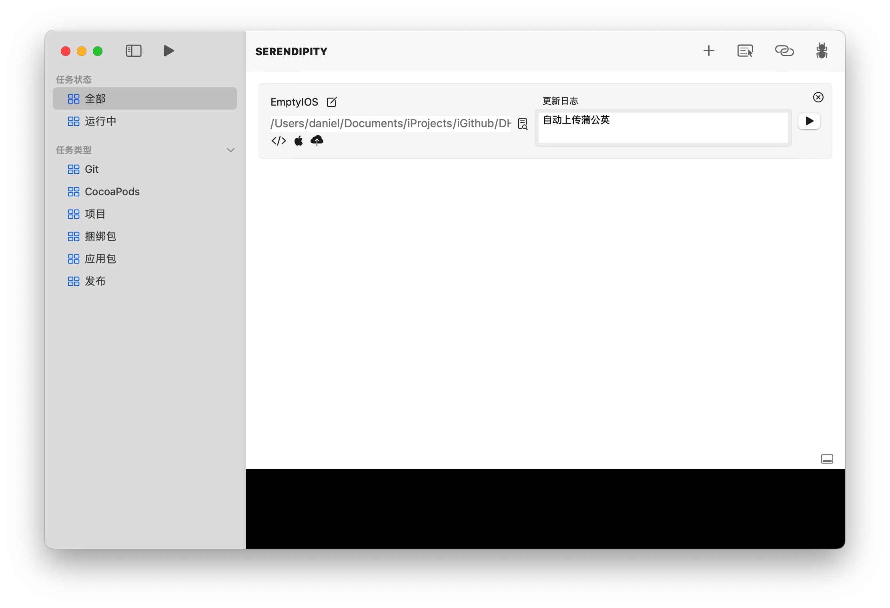

### 描述文件管理器

- 右上角可搜索具体描述文件内所有内容
- 中下方可搜索文件名以及UUID等

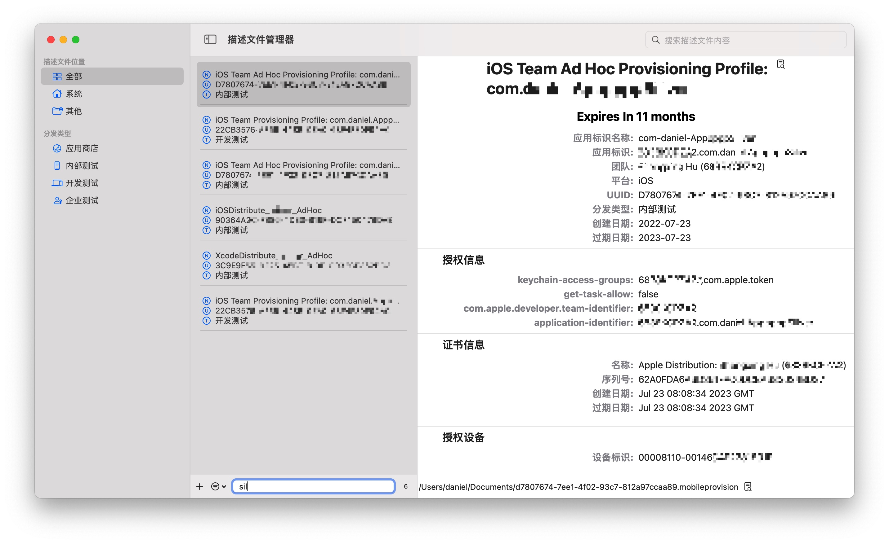

### 符号表管理器

- 由于符号表量大所以展示比较粗糙~ 嘿嘿

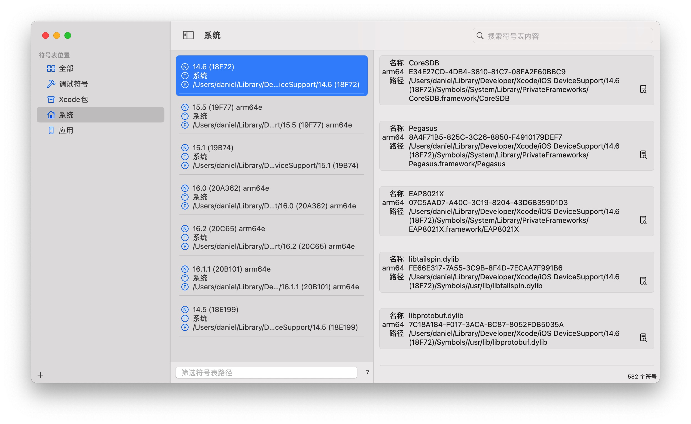

### 符号化工具

-   自定义提供符号表，起始地址以及查询地址进行符号化
-   如需提供UUID查询符号表，必须提前打开符号表管理器方可搜索

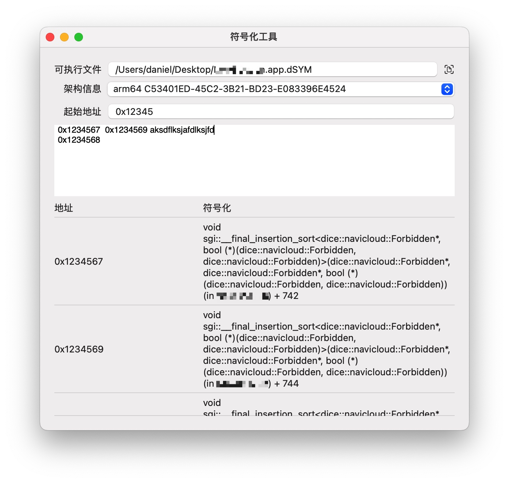

### 崩溃日志

- 支持官方崩溃日志以及友盟日志格式解析
- 日志解析查阅官方文档上的少量异常解析的说明展示
- 支持自定义地址符号化
- 虽然内置了`symbolicatecrash`脚本，但实际上自己参照它的逻辑用swift实现它的功能~ 感觉大概可能或许理论上不会慢~ 嗯，应该不会慢...太多吧

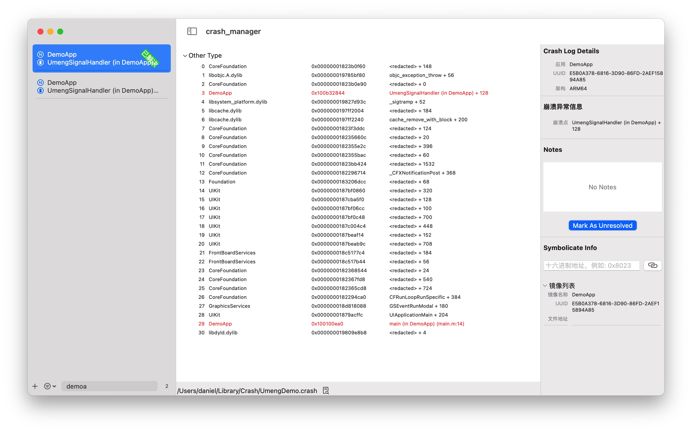

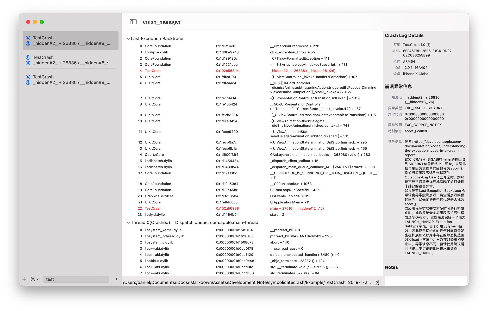

### 应用发布管理/上传

- 管理Pgyer, Fir.im发布的应用列表
- 上传IPA文件可通过添加任务的方式 或直接将IPA文件在应用管理界面拖入最左侧栏中目标平台即可

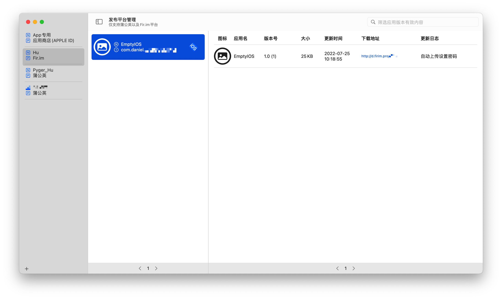

### 自动打包上传

- 添加任务支持文件夹, `.git`, `Podfile`, `.xcworkspace`, `.xcodeproj`, `.ipa`, `.xcarchive`识别。**输入后Enter会开始识别相关内容，如果是文档路径自会识别该路径下所有可识别的文件**
- Xcode项目目前支持编辑版本号（自增）、build号（自增）、签名以及导出配置等。（**如果存在导出配置时，那么结束运行任务后会重置编辑项，相当于编辑项只对运行任务时生效**）
- 添加其他的`.xcarchive`, `.ipa`解析，可在上传时一并导包上传
- 发布配置可支持`蒲公英`、`Fir.im`
- 发布配置理论上支持上传至AppStore，内置写了xcrun altool相关命令。可以试试~

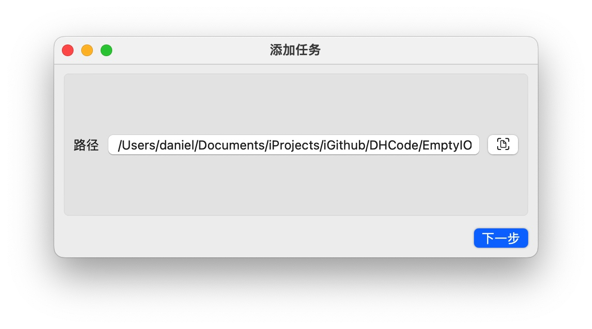

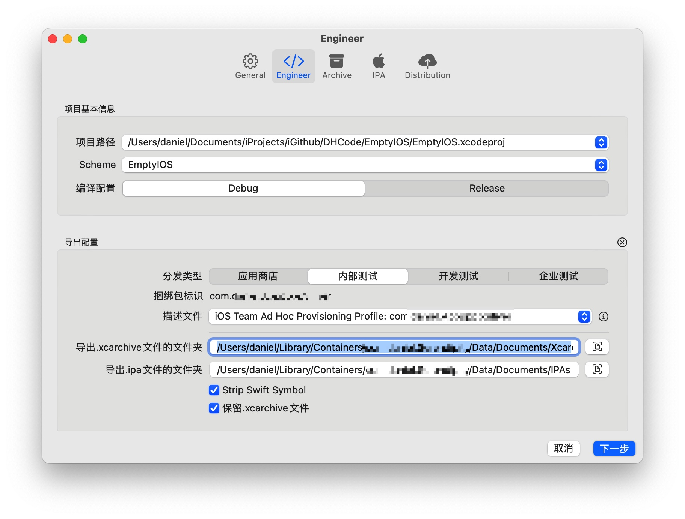

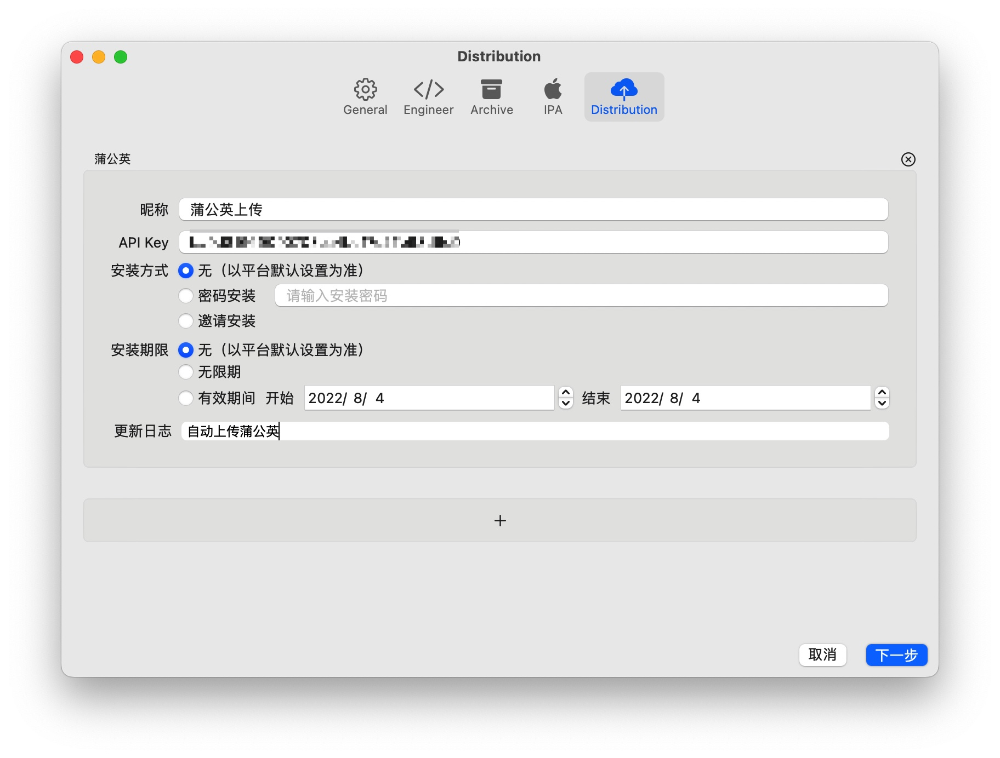

### 自动配置iOS真机调试包

-   检测本地版本与[Github](https://github.com/DanielHusx/DeviceSupports)上配置的版本列表后选择所需下载，下载后将自动拷贝到Xcode.app内。
-   **注意：最后拷贝到Xcode.app内时，会提示输入密码以授权拷贝**

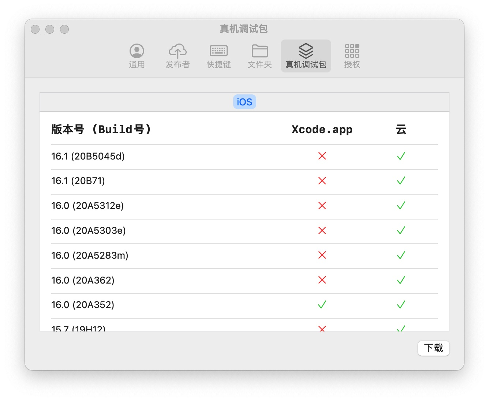

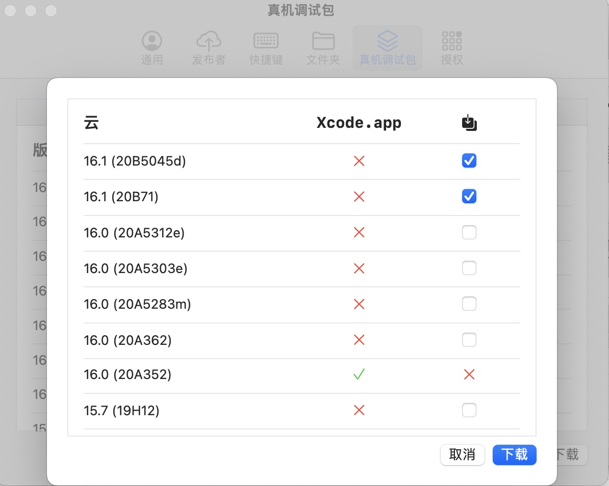

### TODO:
##### 2022-08-08
- [x] 适配xcconfig的情况
- [x] 优化描述文件匹配方案
- [ ] 任务进度管理器
- [x] 快捷键管理器
- [ ] entitlements编辑器
- [x] 蒲公英应用列表
- [x] 错误描述中文化
- [ ] 上传完成后通知或者脚本运行

### NOTE:

##### 2022-11-11 v2.0.0

-   新增快捷键管理器
-   新增自动配置iOS真机调试包
-   新增直接上传IPA（Pgyer, Fir.im）
-   新增符号化工具
-   修复发布信息设置不同步的问题
-   适配崩溃日志双json数据格式解析
-   一定程度上优化内存泄漏
-   优化......balabala...

##### 2022-08-31 v1.0.2
- 新增应用发布列表管理 (支持Pgyer, Fir.im)

- 更新Pgyer上传应用接口

- 修复自动上传设置多发布平台导致线程group崩溃
- 修复崩溃日志二进制列表过多导致崩溃

##### 2022-08-15 v1.0.1
- 新增因正确理解Scheme与Target关系后，解析Xcscheme以适配多Scheme多Configuration的项目～
- 新增`archive`前是否`clean`的选项
- 新增日志输出清空

- 修复复杂项目在执行`xcodebuild archive`命令时可能抛出`PhaseScriptExecution`异常
- 修复解析ipa文件时第一次必然反馈错误的问题

##### 2022-08-05 v1.0

- 修复多Target/Configuration工程配置判断异常导致无法导出

##### 2022-08-04 v1.0

- 七夕发布第一个版本~ （然后发现根本打不开，哈哈哈！）

---
如果你觉得还不错，就赞一个啦~ 谢谢！

### 感谢

-   **[iGhibli/iOS-DeviceSupport](https://github.com/iGhibli/iOS-DeviceSupport)** iOS真机调试包收集（我不生产包，我只是包的搬运工）

##### [MIT LICENSE](LICENSE)
